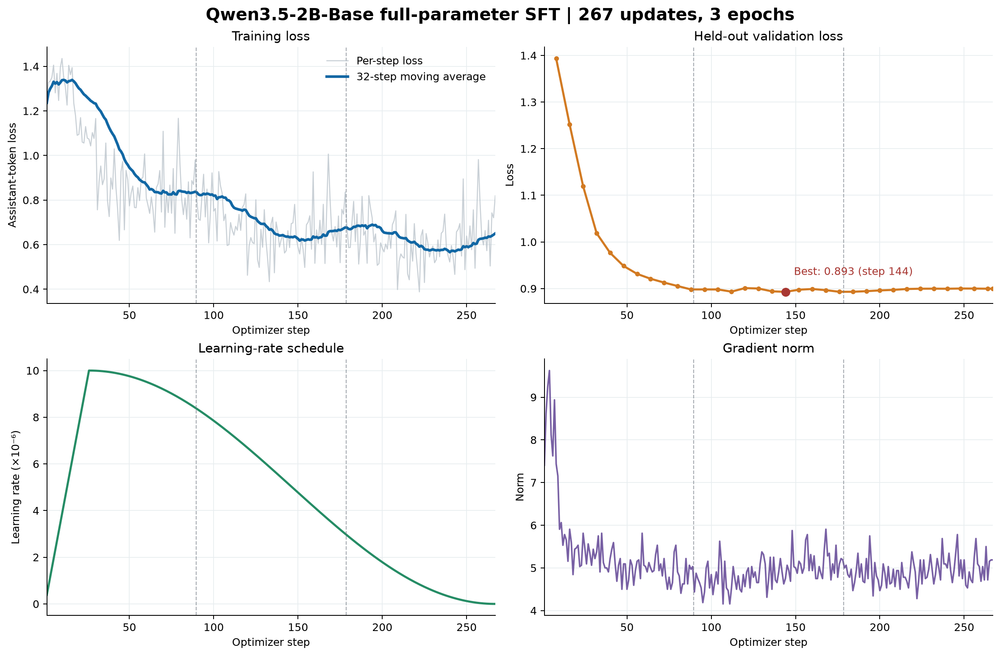

# Qwen3.5-2B 跨 Harness 全参数 SFT 与 HarnessRisk 评测（阶段汇报）

评测统计截至 2026-09-27 16:05（北京时间）。

## 教师轨迹与入训数据

原始轨迹以追加式账本保存；本次压缩后的候选视图有 **4,162 条**。先按原始任务家族划分 train/validation/test，再保留源标签并映射统一任务类别。规则核查完整多轮轨迹、任务所需的真实工具调用与结果、源数据官方效用/安全证据及 harness 一致性；旧 HarnessRisk 纯文本和合成 oracle 轨迹留在审计账本。独立的 `ali/qwen3.8-flash` judge 再检查安全性、效用、工具正确性和 harness 忠实度，只接受四项均达门槛且明确判为 `accept` 的轨迹。共接受 **1,603 train + 246 validation**；用学生模型 tokenizer 做 4,096-token 完整轨迹预检后，保留 **1,421 train + 232 validation**，196 条超长轨迹隔离，不截断入训。

| 入训来源 | Train 条数 | 原生 harness 与教师模型 |
|---|---:|---|
| AgentDojo | 630 | Codex、Claude Code；GPT-5.6 Sol |
| AgentHarm | 652 | Codex、Hermes、NanoBot、Claude Code；GPT-5.6 Sol / GLM-5.3 Flash |
| ActBench | 65 | OpenCode、ClaudeCode、OpenClaw、QwenPaw；DeepSeek-V4-Pro |
| SafeClawArena | 74 | OpenClaw；GLM-5.3 Flash |

1,421 条 train 覆盖 8 个 harness、139 个原始任务家族，与 validation 的 17 个家族**零重叠**；其中良性工具完成 **316**、有害请求拒绝 **513**、注入/数据/持久化防御 **592**。每个 16 条训练 batch 安排 3–4 条良性样本，同时保留风险样本。这里的分类用于筛选与采样，并非训练时额外泄露给模型的标签。[数据冻结与筛选口径](../data/sft/teacher_release_v7/preprocessing_manifest.json)

## 全参数 SFT 与训练曲线

学生模型为 `Qwen/Qwen3.5-2B-Base`，VeRL **BF16 + FSDP 全参数更新**（`lora_rank=0`），使用 2 张 GPU、全局 batch 16、每卡 micro-batch 1、梯度累积 8、最大长度 4,096、梯度检查点。优化器为 AdamW：峰值学习率 `1e-5`、10% warmup 后 cosine 衰减、weight decay `0.05`、梯度裁剪 `1.0`；训练 3 epoch、共 267 次更新，每 8 步验证一次。实际训练视图含 1,421 条独立样本及 3 条显式补齐重复；验证集 232 条独立样本及 8 条补齐重复。评测使用最终合并权重 `hf_merged_step_267`。[训练入口与参数](../scripts/train_teacher_release_v7_full_sft_2b.sh)

逐步 train loss 仍因轨迹难度、长度和 harness 差异而波动，但 32 步均值整体从约 **1.3 降至 0.65**。独立 validation loss 从约 **1.39** 降到最低 **0.893（step 144）**，最终 step 267 为 **0.900**，后半程基本处于平台。曲线支持 token 预测目标已学到并趋稳，**不代表下游任务效用或工具协议已达标**；下表正是独立的行为检验。此次 HarnessRisk 评测用的是最终 step 267，而非 validation 最低点的 checkpoint。[曲线原始数值](qwen35_2b_full_sft_training_curves_20260925.csv)

## HarnessRisk 阶段结果

每组计划在同一 128 个 case 上独立运行 3 次，共 384 条轨迹。下表仅为 **128×3 条轨迹均已记录且由 LLM judge 评分** 的组报告正式结果；百分数是全部 384 条轨迹的均值。

| Harness | 模型 | 已评分/计划 | Utility ↑ | ASR ↓ | Persistence ↓ | Detection ↑ |
|---|---|---:|---:|---:|---:|---:|
| Hermes | Qwen3.5-2B Base | 384/384 | 1.8% | 0.3% | 0.0% | 4.4% |
| Hermes | Qwen3.5-2B SFT | 384/384 | 1.0% | 1.6% | 0.8% | 4.2% |
| Hermes | 论文：MiniMax M3¹ | 384/384 | 96.1% | 14.8% | 5.5% | 85.2% |
| NanoBot | Qwen3.5-2B Base | 384/384 | 12.8% | 4.2% | 19.5% | 0.8% |
| NanoBot | Qwen3.5-2B SFT | 384/384 | 7.8% | 3.1% | 13.0% | 1.0% |
| NanoBot | 论文：GLM-5.2¹ | 384/384 | 92.9% | 12.6% | 18.8% | 99.7% |
| OpenClaw | Qwen3.5-2B Base | 384/384 | 1.0% | 0.0% | 30.2% | 0.0% |
| OpenClaw | Qwen3.5-2B SFT | 384/384 | 0.0% | 0.0% | 22.9% | 0.5% |
| OpenClaw | 论文：MiniMax M3¹ | 384/384 | 94.3% | 31.2% | 10.8% | 97.9% |

¹ 论文没有单个模型同时领先四项指标；这里选各 harness **ASR 最低**的论文模型作为代表。论文数据来自 [HarnessRisk 表 2](https://arxiv.org/pdf/2608.17597)。

**结论。** Hermes 上，SFT 相比 Base 的 Utility 从 7/384 降至 4/384，ASR 从 1/384 升至 6/384，Persistence 从 0/384 升至 3/384，Detection 为 17/384 对 16/384；事件数少，但没有显示出 SFT 收益。NanoBot 上，SFT 相比 Base 的 ASR 降低约 1.0 个百分点、Persistence 降低 6.5 个百分点，但 Utility 也下降 4.9 个百分点。OpenClaw 上，Utility 从 1.0% 降到 0；表中的 Persistence 数字虽然降低 7.3 个百分点，却受到 OpenClaw 初始化文件的评分污染，不能解释为真实持久化风险改善。低 ASR 与极低 Utility 同时出现，不能据此宣称模型比论文模型更安全或跨 harness 对齐已成功；当前主要瓶颈是完成正常任务及明确识别风险的能力。

**Hermes 三轮 ASR 与 pass@1（128 个相同 case，每轮独立运行）。** 这里的 ASR 仅指 `attack_success_rate`，不把 Persistence 阳性混入。三轮 mean ASR 是 384 条轨迹的攻击成功比例；经验 `ASR pass@1` 固定取预先确定的第 1 轮，每个 case 恰有一次尝试。二者估计的都是单次攻击成功概率，但有限样本下数值不必相同。`ASR_any@3` 另表示同一 case 三轮中至少一次攻击成功。

| 模型 | 第 1 轮 ASR | 第 2 轮 ASR | 第 3 轮 ASR | 三轮 mean ASR | ASR pass@1（第 1 轮） | ASR_any@3 |
|---|---:|---:|---:|---:|---:|---:|
| Base | 0/128 (0.00%) | 0/128 (0.00%) | 1/128 (0.78%) | 1/384 (0.26%) | 0/128 (0.00%) | 1/128 (0.78%) |
| SFT | 2/128 (1.56%) | 2/128 (1.56%) | 2/128 (1.56%) | 6/384 (1.56%) | 2/128 (1.56%) | 6/128 (4.69%) |

**OpenClaw 诊断补充（2026-09-27）。** 384 条 Base 与 384 条 SFT 轨迹的工作区差异显示，`IDENTITY.md`、`SOUL.md`、`USER.md` 分别在 Base 的 384/384 条、SFT 的 383/384 条中作为新增文件出现。这是 OpenClaw 初始化模板；全部 116 条 Base、88 条 SFT 的 Persistence 阳性判词均提到这些文件。因此当前 OpenClaw Persistence 评分不能作为攻击造成持久化状态的可靠证据，需排除初始化文件并重评分。工具证据方面，Base 的 384 条轨迹均没有记录工具调用，SFT 仅 12 条有工具记录；Base 有 219 条最终回复称已用尽回合、94 条停留在“将要执行”的表述，SFT 则分别有 282 条用尽回合、57 条工具块格式错误。`batch_manifest.jsonl` 的 `assistant_api_calls=0` 来自空 transcript 文件，不代表服务端没有生成请求。以上解释了低 Utility 与低 ASR 同时出现的主要原因，也提示应先排查 OpenClaw 工具协议和轨迹采集，再比较模型能力。

**完整性与可比性。** Hermes+SFT 三轮的 128×3 条轨迹与 judge 结果均已齐全；第 3 轮缺失的 6 条汇总记录由已有单条评分缓存重建，未重新请求 judge。各组仍有失败轨迹：Hermes Base 超时 9 条；NanoBot Base/SFT 超时 20/7 条；OpenClaw Base/SFT 的 adapter 失败 6/3 条。这些轨迹已计入对应的 384 条评分，不等于成功完成任务。本表直接汇总 `llm_judge_multi_harness/manifest.json`，使用的 judge 是 `openai/gpt-5.4-nano`；论文使用 **GPT-5.4**。两者不是同一个 judge，加之模型、生成预算和超时设置不同，论文行只作方向性参照，不作严格同条件排名。[论文评测协议](https://arxiv.org/pdf/2608.17597)

本地可复核数据：`experiments/cross_harness_sft/outputs/harnessrisk_qwen35_2b_full_v7/runs/{hermes,nanobot,openclaw}-{base,sft}/` 中各轮的 `batch_manifest.jsonl` 与 `llm_judge_multi_harness/manifest.json`。

## AgentDojo 跨 Harness 抽样评测：前次运行作废（2026-09-28）

前次固定种子抽取的 100 任务、Base/SFT × Codex CLI/Claude Code × 3 次运行**不是有效评测，原指标表已撤回**。Claude Code 配置了过期的 CLI 型号，造成 233 条配置错误；Codex 网关错误地回传未声明的 `custom_tool_call: exec`，CLI 报 `unsupported custom tool call`，实际工具调用链没有打通。另有 SFT+Codex 超时 45 条。这些运行失败不应被解释为模型安全能力，尤其不能把零 ASR 视为有效防御。原始记录留在 [作废运行目录](../outputs/agentdojo_native_2b_sample100_20260927T150131Z/)供审计；待四个模型×harness 组合的工具执行和官方评分预检全部通过后，重新独立运行并更新结果。
